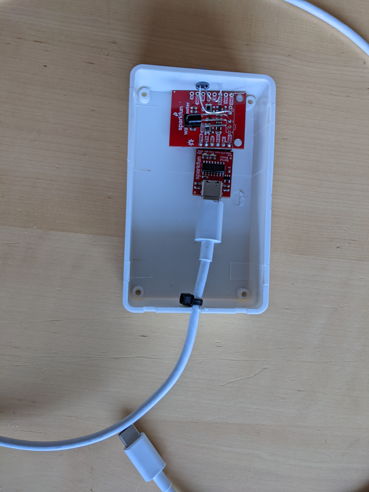
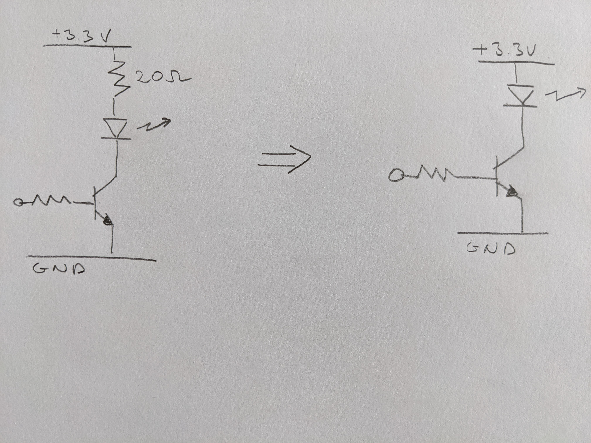

# WiFiIRBlaster

The code for the IR Server is just a slight modification of the
Arduino example that comes with the *IRremoteESP8266* library.

The IRreceivDumpV2 is unchanged, but is here because it is really
useful to capture the codes sent by a real world remote controls.
Once the codes are captured as hexadecimal values they need to be
converted to decimal, before they can be processed by the IR Server.
One converter that is easy to use for this is found at
[Hexadecimal to Decimal Converter](https://www.binaryhexconverter.com/hex-to-decimal-converter)

An **Android app** that works together with this code can be found
at [Android App](https://github.com/heimir-sverrisson/HiFiRemote).

The hardware used is
[Sparkfun WiFi IR Blaster](https://www.sparkfun.com/products/15031)

Together with a USB serial breakout board
[Sparkfun Serial Basic Breakout](https://www.sparkfun.com/products/15096)

The serial breakout board is used both for programming the Wifi Blaster
and the providing it with power when running standalone.

In order to be able to have the unit further away from the HiFi setup,
the IR LED that comes with the kit was replaced with a more powerful
one and wired as shown below, bypassing the 20 Ohm resistor of the
original circuit to provide more power.

The replacement IR Diode is available from Adafruit
[Super-bright 5mm IR LED](https://www.adafruit.com/product/388)

Here is the [datasheet](https://cdn-shop.adafruit.com/datasheets/IR333_A_datasheet.pdf) for it.